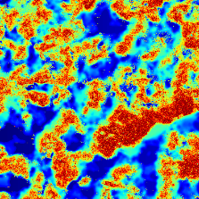
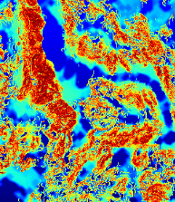
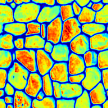
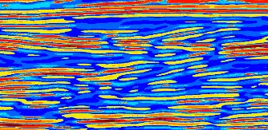
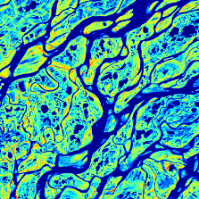
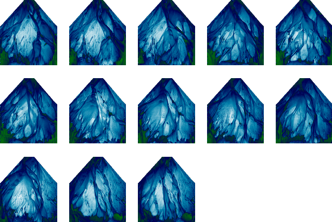
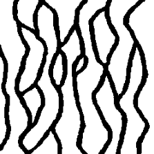
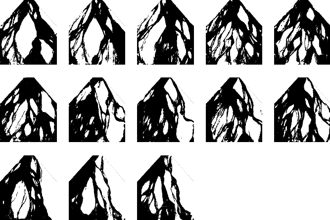
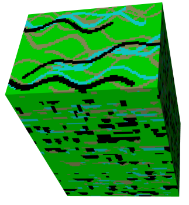

GeoStatsImages.jl
=================

Training images for geostastical simulation.

[](https://travis-ci.org/juliohm/GeoStatsImages.jl)
[](http://pkg.julialang.org/?pkg=GeoStatsImages&ver=0.4)

Installation
------------

```julia
Pkg.add("GeoStatsImages")
```

Usage
-----

```julia
TI = training_image(identifier::AbstractString)
```
where `identifier` can be any of the strings listed with the command `GeoStatsImages.available`

Preview
-------

### Continuous

#### WalkerLake


#### WalkerLakeTruth


#### StoneWall


#### Herten


#### Lena


#### FlumeContinuous{01,02,...,13}


### Categorical

#### Strebelle


#### FlumeBinary{01,02,...,13}


#### WestCoastAfrica


REFERENCES
----------

Gregoire, M.; Caers, J., 2014. Multiple-point Geostatistics: Stochastic Modeling with Training Images. [[WEBSITE](http://trainingimages.org)]

St. Anthony Falls Laboratory, University of Minnesota. [[WEBSITE](https://www.esci.umn.edu/orgs/seds/Sedi_Research.htm)]
