# GeoStatsImages.jl

*Training images for geostastical simulation in Julia.*

[](https://github.com/JuliaEarth/GeoStatsImages.jl/actions)
[](https://codecov.io/gh/JuliaEarth/GeoStatsImages.jl)

This package converts famous training images from the geostatistcs
literature to a standard format for quick experimentation in Julia.
It is part of the [GeoStats.jl](https://github.com/juliohm/GeoStats.jl)
framework and can be used in conjunction with multiple-point simulation
algorithms.

The standard format is a geotable as discussed in the book
[*Geospatial Data Science with Julia*](https://juliaearth.github.io/geospatial-data-science-with-julia).
Continuous variables as stored as `"value"` whereas categorical
variables are stored `"code"`.

**The contributors of this package do not hold any copyright on the
data. Please give credit to the sources listed on the preview table.**

## Usage

The `geostatsimage` function takes an image *name* and returns a
geotable. Please run `GeoStatsImages.available()` to discover all
available image names.

```julia
julia> geostatsimage("WalkerLake")
                 78000×2 GeoTable over 260×300 CartesianGrid
┌─────────────┬─────────────────────────────────────────────────────────────┐
│    value    │                          geometry                           │
│ Continuous  │                         Quadrangle                          │
│  [NoUnits]  │                    🖈 Cartesian{NoDatum}                     │
├─────────────┼─────────────────────────────────────────────────────────────┤
│     0.0     │ Quadrangle((x: 0.0 m, y: 0.0 m), ..., (x: 0.0 m, y: 1.0 m)) │
│ 1.28207e-5  │ Quadrangle((x: 1.0 m, y: 0.0 m), ..., (x: 1.0 m, y: 1.0 m)) │
│ 2.56414e-5  │ Quadrangle((x: 2.0 m, y: 0.0 m), ..., (x: 2.0 m, y: 1.0 m)) │
│  3.8462e-5  │ Quadrangle((x: 3.0 m, y: 0.0 m), ..., (x: 3.0 m, y: 1.0 m)) │
│ 5.12827e-5  │ Quadrangle((x: 4.0 m, y: 0.0 m), ..., (x: 4.0 m, y: 1.0 m)) │
│ 6.41034e-5  │ Quadrangle((x: 5.0 m, y: 0.0 m), ..., (x: 5.0 m, y: 1.0 m)) │
│ 7.69241e-5  │ Quadrangle((x: 6.0 m, y: 0.0 m), ..., (x: 6.0 m, y: 1.0 m)) │
│ 8.97447e-5  │ Quadrangle((x: 7.0 m, y: 0.0 m), ..., (x: 7.0 m, y: 1.0 m)) │
│ 0.000102565 │ Quadrangle((x: 8.0 m, y: 0.0 m), ..., (x: 8.0 m, y: 1.0 m)) │
│ 0.000115386 │ Quadrangle((x: 9.0 m, y: 0.0 m), ..., (x: 9.0 m, y: 1.0 m)) │
│      ⋮      │                              ⋮                              │
└─────────────┴─────────────────────────────────────────────────────────────┘
                                                           77990 rows omitted
```

## Preview

| Name | Preview | Type | Data source |
| ---- |:-------:| ---- | ----------- |
| WalkerLake | 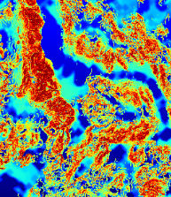 | Continuous | [Mariethoz & Caers, 2014][TI-book-url] |
| StoneWall | 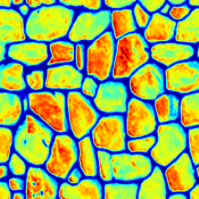 | Continuous | [Mariethoz & Caers 2014][TI-book-url] |
| Herten | 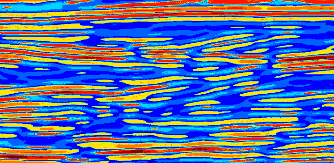 | Continuous | [Mariethoz & Caers 2014][TI-book-url] |
| Lena | 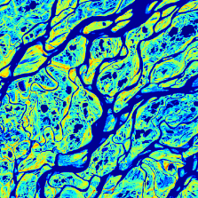 | Continuous | [Mariethoz & Caers 2014][TI-book-url] |
| IceWedges | 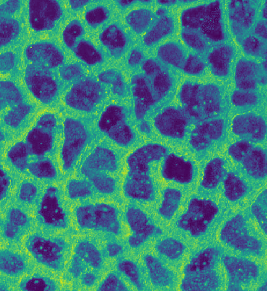 | Continuous | [Mariethoz & Caers 2014][TI-book-url] |
| StanfordV | 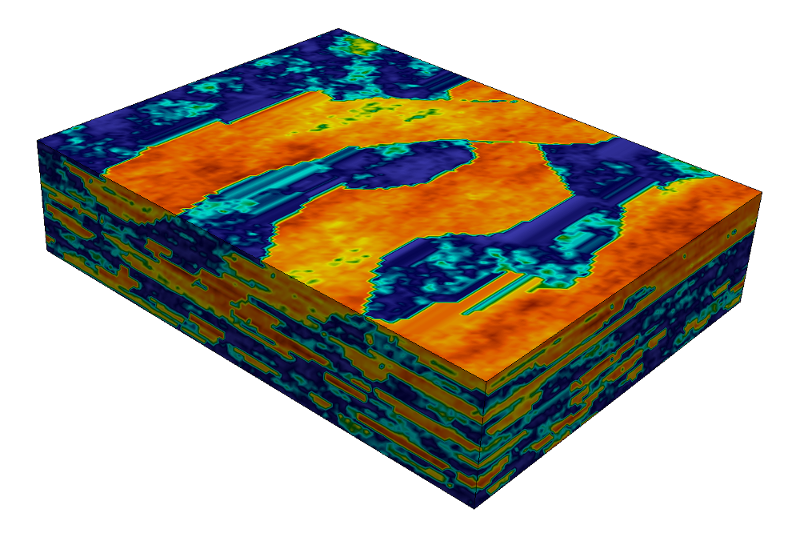 | Continuous | [Mao & Journel 2014][StanfordV-url] |
| Gaussian30x10 | 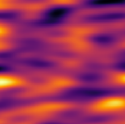 | Continuous | [Hoffimann 2020][Gaussian30x10-url] |
| Strebelle | 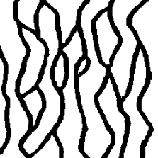 | Categorical | [Strebelle 2002][SNESIM-url] |
| Ellipsoids | 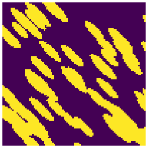 | Categorical | [Mariethoz & Caers 2014][TI-book-url] |
| Bangladesh | 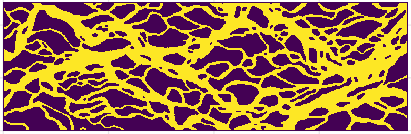 | Categorical | [Mariethoz & Caers 2014][TI-book-url] |
| Concrete | 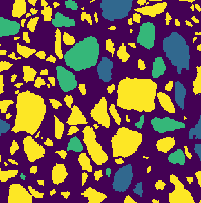 | Categorical | [Mariethoz & Caers 2014][TI-book-url] |
| Dunes | 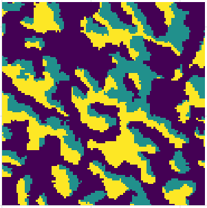 | Categorical | [Mariethoz & Caers 2014][TI-book-url] |
| Jha2014 | 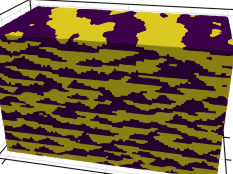 | Categorical | [Mariethoz & Caers 2014][TI-book-url] |
| Ohau | 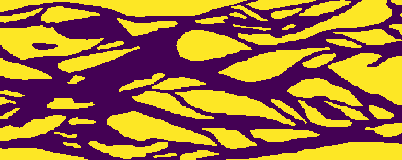 | Categorical | [Mariethoz & Caers 2014][TI-book-url] |
| WestCoastAfrica | 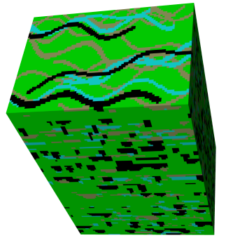 | Categorical | [Mariethoz & Caers 2014][TI-book-url] |
| Flumy | 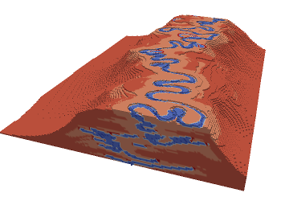 | Categorical | [Hoffimann et al 2017][IQSIM-url] |
| Fluvsim | 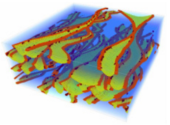 | Categorical | [Mariethoz & Caers, 2014][TI-book-url] |
| Ketton | 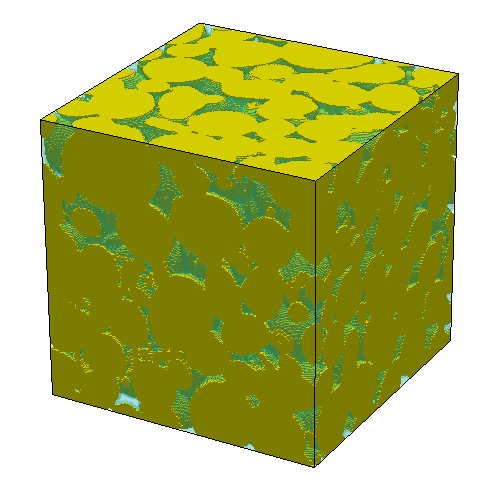 | Categorical | [Imperial College Pore-Scale Modelling Group][Imperial-college] |

### Collections

[St. Anthony Falls Laboratory](https://www.esci.umn.edu/orgs/seds/Sedi_Research.htm)

#### FlumeContinuous
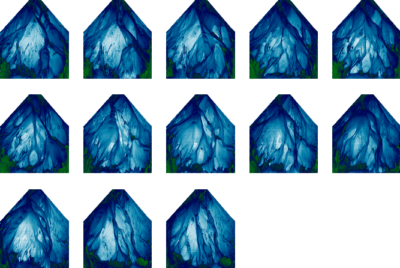

#### FlumeBinary
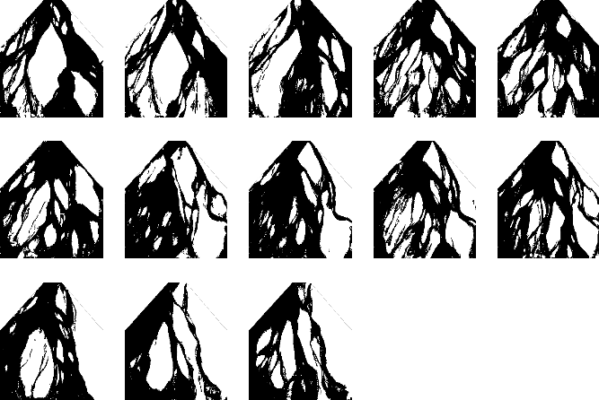

## Contributing

Contributions are very welcome, as are feature requests and suggestions.

If you have any questions, please [contact our community](https://juliaearth.github.io/GeoStats.jl/stable/about/community.html).

[TI-book-url]: https://trainingimages.org
[StanfordV-url]: https://pangea.stanford.edu/departments/ere/dropbox/scrf/documents/reports/12/SCRF1999_Report12/SCRF1999_shuguang/stanford4.ps.zip
[Gaussian30x10-url]: https://github.com/JuliaEarth/GeoStatsTutorials
[SNESIM-url]: https://link.springer.com/article/10.1023/A%3A1014009426274
[IQSIM-url]: https://www.sciencedirect.com/science/article/pii/S0098300417301139
[Imperial-college]: http://www.imperial.ac.uk/earth-science/research/research-groups/perm/research/pore-scale-modelling/micro-ct-images-and-networks
