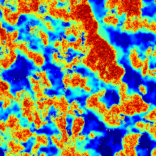

GeoStatsImages.jl
=================

*Training images for geostastical simulation in Julia.*

[![][build-img]][build-url] [![][codecov-img]][codecov-url]

This package converts famous training images from the geostatistcs
literature to a standard format for quick experimentation in Julia.
It is part of the [GeoStats.jl](https://github.com/juliohm/GeoStats.jl)
framework and can be used in conjunction with multiple-point simulation
solvers.

**The author does not hold any copyright on the data. Please give credit to the sources in the table.**

Usage
-----

```julia
TI = geostatsimage(identifier)
```
where `identifier` can be any of the strings listed with the command `GeoStatsImages.available()`

Preview
-------

| Identifier | Preview | Type | Data source |
| ---------- |:-------:| ---- | ----------- |
| WalkerLake |  | Continuous | [Mariethoz & Caers, 2014][TI-book-url] |
| WalkerLakeTruth |  | Continuous | [Mariethoz & Caers, 2014][TI-book-url] |
| StoneWall |  | Continuous | [Mariethoz & Caers 2014][TI-book-url] |
| Herten |  | Continuous | [Mariethoz & Caers 2014][TI-book-url] |
| Lena |  | Continuous | [Mariethoz & Caers 2014][TI-book-url] |
| StanfordV |  | Continuous | [Mao & Journel 2014][StanfordV-url] |
| Gaussian30x10 |  | Continuous | [Hoffimann 2020][Gaussian30x10-url] |
| Strebelle |  | Categorical | [Strebelle 2002][SNESIM-url] |
| Ellipsoids |  | Categorical | [Mariethoz & Caers 2014][TI-book-url] |
| WestCoastAfrica |  | Categorical | [Mariethoz & Caers 2014][TI-book-url] |
| Flumy |  | Categorical | [Hoffimann et al 2017][IQSIM-url] |
| Fluvsim |  | Categorical | [Mariethoz & Caers, 2014][TI-book-url] |
| Ketton |  | Categorical | [Imperial College Pore-Scale Modelling Group][Imperial-college] |

### Collections

[St. Anthony Falls Laboratory](https://www.esci.umn.edu/orgs/seds/Sedi_Research.htm)

#### FlumeContinuous


#### FlumeBinary


Contributing
------------

Contributions are very welcome, as are feature requests and suggestions.

If you have any questions, please contact our community on the [gitter channel](https://gitter.im/JuliaEarth/GeoStats.jl).

[TI-book-url]: https://trainingimages.org
[StanfordV-url]: https://pangea.stanford.edu/departments/ere/dropbox/scrf/documents/reports/12/SCRF1999_Report12/SCRF1999_shuguang/stanford4.ps.zip
[Gaussian30x10-url]: https://github.com/JuliaEarth/GeoStatsTutorials
[SNESIM-url]: https://link.springer.com/article/10.1023/A%3A1014009426274
[IQSIM-url]: https://www.sciencedirect.com/science/article/pii/S0098300417301139
[Imperial-college]: http://www.imperial.ac.uk/earth-science/research/research-groups/perm/research/pore-scale-modelling/micro-ct-images-and-networks

[build-img]: https://img.shields.io/github/actions/workflow/status/JuliaEarth/GeoStatsImages.jl/CI.yml?branch=master&style=flat-square"
[build-url]: https://github.com/JuliaEarth/GeoStatsImages.jl/actions

[codecov-img]: https://codecov.io/gh/juliohm/GeoStatsImages.jl/branch/master/graph/badge.svg
[codecov-url]: https://codecov.io/gh/juliohm/GeoStatsImages.jl
