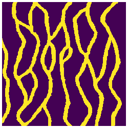

TrainingImages.jl
=================

Training images for geostastical simulation.

Installation
------------

```julia
Pkg.add("TrainingImages")
```

Usage
-----

```julia
TI = training_image(identifier::String)
```
where `identifier` can be any of the strings listed with the command `TrainingImages.available`

Preview
-------

### Continuous

### Categorical
#### Strebelle


REFERENCES
----------

Gregoire, M.; Caers, J., 2014. Multiple-point Geostatistics: Stochastic Modeling with Training Images. [[WEBSITE](http://trainingimages.org)]
